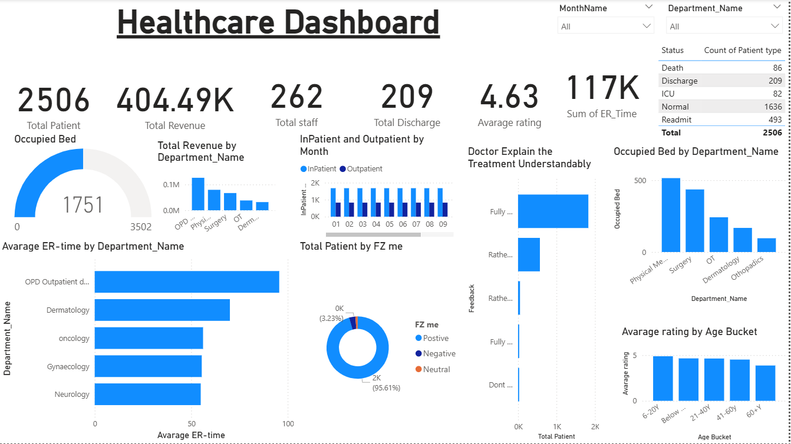

# 🏥 Healthcare Management Dashboard – Power BI Project

This repository presents an interactive **Healthcare Dashboard** built in **Power BI**, leveraging real-world hospital and patient data to visualize key performance indicators across departments, patient types, ER times, feedback, and more.

---

## 📁 Repository Contents

| File                                            | Description                                                                                 |
| ----------------------------------------------- | ------------------------------------------------------------------------------------------- |
| `Healthcare Dashboard.pbix`                     | Power BI report file visualizing healthcare KPIs and departmental insights.                 |
| `Hospital Health Care Management Data set.xlsx` | Raw dataset containing patient details, department info, staff data, ER time, ratings, etc. |
| `Screenshot (363).png`                          | Dashboard screenshot showing layout and visuals for quick reference.                        |

---

## 🎯 Project Objective

The goal of this dashboard is to enable **data-driven decisions in healthcare management** by visualizing:

* Patient flow (inpatient vs outpatient)
* Staff efficiency and distribution
* ER response times by department
* Revenue generation by department
* Patient satisfaction and feedback trends

---

## 📊 Key Dashboard Features

| Metric    | Description                                             |
| --------- | ------------------------------------------------------- |
| `2506`    | Total patients (by type: ICU, discharge, readmit, etc.) |
| `404.49K` | Total revenue generated                                 |
| `262`     | Total staff count                                       |
| `209`     | Discharged patients                                     |
| `4.63`    | Average patient feedback rating                         |
| `117K`    | Sum of ER time (minutes)                                |

### 🔍 Visualizations Include:

* **Gauge** for occupied beds vs total
* **Bar charts** for ER time by department, revenue by department, and patient count by feedback
* **Pie chart** for patient sentiment (positive, neutral, negative)
* **Stacked column charts** for Inpatient vs Outpatient trends by month
* **Average rating distribution** by age group
* **Dynamic filters** for month, department, and patient status

---

## 🛠️ Data Sources

The dataset is stored in `Hospital Health Care Management Data set.xlsx`, which includes:

* `Bed_Detail`: Bed availability and usage by department
* `Calendar_date`: Time dimension for monthly filtering
* `Department`: Metadata about departments
* `Detail data dataset`: Patient feedback, ratings, ER time
* `Staff_Detail`: Count of staff by department and type

---

## 🚀 How to Use

### Requirements:

* [Power BI Desktop](https://powerbi.microsoft.com/desktop/)

### Steps:

1. Clone/download this repository.
2. Open `Healthcare Dashboard.pbix` in Power BI Desktop.
3. Explore, modify, or extend the dashboard using built-in filters and visuals.
4. Replace the dataset with your own hospital data (if needed) and refresh visuals.

---

## 💡 Use Cases

* Hospital administration and performance reporting
* Departmental performance tracking (ER wait times, ratings, occupancy)
* Patient experience and satisfaction analysis
* Staff planning and allocation based on department load

---

## 📌 Customization Tips

* Add new KPIs (e.g., cost per patient, average stay)
* Include predictive modeling (e.g., ER overload forecasting)
* Create departmental drill-through reports
* Use DAX to calculate advanced metrics like readmission rate %

---

## 📜 License

This project is released under the **MIT License**. See the [LICENSE](LICENSE) file for full terms.

---

## 🙏 Acknowledgments

* Inspired by real-world hospital reporting systems
* Built using Power BI's interactive visual analytics
* Data cleaned and modeled using Excel & Power Query

---

## 🙋‍♀️ Author

Developed by **Marmik Gandhi** Feel free to connect:  
- GitHub: [@MarmikGandhi](https://github.com/MarmikGandhi)
- Email: [marmikgandhi@gamil.com](mailto:marmikgandhi@gamil.com)
- LinkedIn: [marmik-gandhi](https://www.linkedin.com/in/marmik-gandhi-006a55323/)
